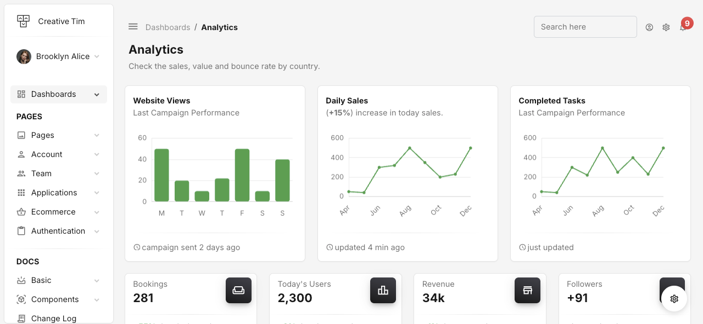

# 📢 CMS-News - Content Management System for News

Welcome to **CMS-News**, a dynamic and user-friendly content management system designed for managing and publishing news articles efficiently. This project is built using **PHP**, **MySQL**, and modern web technologies to provide a seamless experience for both admins and readers.


---

## 🚀 Features

✅ **User Authentication** - Secure login and user roles (Admin, Editor, Reader).  
✅ **Article Management** - Create, edit, delete, and publish articles with ease.  
✅ **Category & Tag System** - Organize news articles effectively.  
✅ **SEO Optimization** - Meta descriptions and friendly URLs.  
✅ **Responsive Design** - Fully mobile-friendly UI/UX.  
✅ **Comment System** - Engage users with article comments.  
✅ **Admin Dashboard** - A powerful admin panel for content management.  

---

## 📂 Project Structure

```plaintext
cms-news/
│── index.php          # Main entry point
│── config.php         # Database configuration
│── admin/             # Admin dashboard
│── assets/            # CSS, JS, images
│── includes/          # Reusable PHP scripts
│── templates/         # Frontend layouts
│── uploads/           # Article images and media
│── .env               # Environment variables
│── README.md          # Documentation
```

---

## 🛠️ Installation Guide

1. **Push Your Code Into Remote Repositpry**
   ```sh
    git add . # Add all file into git
    git commit -m "your commit message" # Save change 
    git remote add <remote-name> <your-remote-url>
    git push -u  <remote-name> <your-branch>

   ```

2. **Set Up the Database**
   - Import `database.sql` into MySQL.
   - Update `config.php` with your database credentials.

3. **Configure Environment**
   - Create a `.env` file and set your database credentials.

4. **Run the Application**
   - Start the server using:
     ```sh
     php -S localhost:8000
     ```
   - Open `http://localhost:8000` in your browser.

---

## 📸 Screenshots

| Dashboard | Article Management | Reader View |
|-----------|--------------------|-------------|
|  |  |  |

---

## 🏗️ Tech Stack

- **Backend:** PHP, MySQL
- **Frontend:** HTML, CSS, JavaScript, Bootstrap
- **Libraries:** jQuery, TinyMCE (for rich text editing)
- **Security:** Prepared Statements, Password Hashing

---

## 📌 To-Do List

- [ ] Implement REST API for mobile integration
- [ ] Add dark mode support
- [ ] Improve analytics and reporting

---

## 🤝 Contributing

We welcome contributions! To contribute:
1. Fork the repository.
2. Create a feature branch.
3. Commit changes and push.
4. Open a pull request.

---

## 📜 License

This project is licensed under the **MIT License**.

---

## 📬 Contact & Support

📧 Email: [your-email@example.com](mailto:your-email@example.com)  
🌐 Website: [yourwebsite.com](https://yourwebsite.com)  
💬 Discord: [Join Community](#)  

---

> ⭐ **If you like this project, give it a star on GitHub!** 🚀

